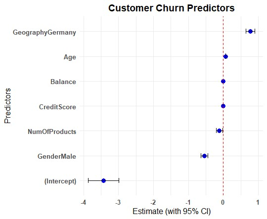

## Bank Customer Churn Analysis

**Tools used:** R | PowerPoint 

**Description:**  
An end-to-end statistical analysis of bank customer churn using Maven 
Analytics data. The analysis identified statistically significant predictors 
of churn, revealing that 20.4% of customers were lost. Key drivers were 
operating geography and age demographics — with Germany operations and 
customers aged 46–60 showing disproportionately higher churn rates. 
R was used for data cleaning, manipulation and visualisation, with findings 
presented in a structured PowerPoint report. Mitigation strategies and 
recommendations for further investigation were proposed.

[View Full Report (PDF)](./Customer_Churn_Analysis.pdf)

[View R Script](./Churn_Customer.R)
