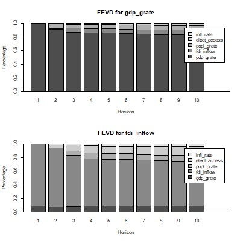

## Does a Causal Relationship Exist Between FDI and Economic Growth?
### A Time Series Analysis of Nigeria's Economy (1991–2021)

**Tools used:** R | PowerPoint | VAR Modelling | Time Series Analysis

**Description:**  
An MSc research project applying the Endogenous Growth Theoretical 
Framework and a Vector Autoregressive (VAR) model to assess the dynamic 
relationship between FDI, GDP growth, and key endogenous growth factors 
in Nigeria over a 30-year period. Advanced statistical techniques including 
Impulse Response Analysis (IRA) and Forecast Error Variance Decomposition 
(FEVD) were employed. Key finding: no causal relationship was identified 
between FDI and economic growth in Nigeria — suggesting that economic 
stability and sectoral targeting may carry more weight than FDI volume alone. 
Findings are presented in an executive-style report for policymakers and 
analysts.

[View Executive Summary (PDF)](./Executive_Summary_Report.pdf)

[View R Script](./RScript_Dissertation_s5506989.R)
