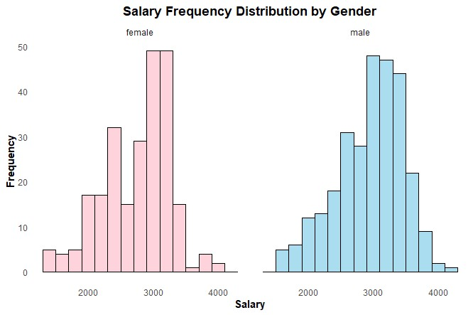

## Evaluating the Gender Pay Gap in a UK Company

**Tools used:** R | PowerPoint

**Description:**  
The gender pay gap remains a persistent challenge in the UK labour market. 
As of April 2023, women earned 14.3% less per hour than men across all 
employees. This project analyses employee data for a UK company to determine 
whether a gender pay gap exists and identify the key factors driving it. 
Findings confirm a statistically significant pay gap — male employees earned 
6.9% more on mean monthly salary and 5.3% more on median monthly salary than 
female counterparts. Further analysis identified employment tenure, contract 
type, qualification level, and job position as statistically significant 
drivers of the gap. R was used for data cleaning, transformation and 
visualisation, with findings presented in a structured PowerPoint report 
alongside actionable recommendations.

[View Full Report (PDF)](./Evaluating_the_Equal_Pay_Gap.pdf)

[View R Script](./Business_Intel_RScript_Final.R)
